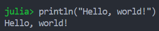

13:22, 2019-09-08: Read the book *an introduction to game theory*. Amazed to know Von Neumann got his math Ph.D. only one year after he graduated in Chemistry. Also, he mastered Calculus when he was eight while some university students now are still struggling. I feel ashamed that he published his first work which eluded Borel in his second year. Really sorry for his only 54-year-long life. Maybe he wanted to leave something for us to do! :grin:

15:54, 2019-09-09: First day in the new term! Plus, happy birthday(lunar) to myself! Cannot wait to meet my real birthday!:laughing:

23:28, 2019-09-09: What a wonderful day! Everything is good and everyone is kind. Sleep tight guys!:smirk:

12:50, 2019-09-10: It seems that I cannot get the course I want... So sad...:cry:

18:16, 2019-09-10: Totally heartbroken to finally figure out that I have 2 over-600-page textbook, 1 over-400-page textbook, and 1 over-1400-page textbook(*art of assembly language*) to read this term already! Anyway, happy Teachers' day!

18:22, 2019-09-10: Really amazed! It seems everybody is taking Assembly Language class! What's wrong with all the students? The whole classroom which has capacity of 200 people is overcrowded!

20:58, 2019-09-10: Had my first Assembly Language class. It is so fascinating! Professor taught us how to crack a simple password verification exe file. Totally impressed by him!:grin:

19:25, 2019-09-11: I had three wonderful classes today. Professor of **Fixed Income Assets** is handsome and has really good pronunciation(so does my **Intermediate microeconomics** teacher). Professor of **Economic Law** is a famous lawyer himself and shared a lot of cases he went though. Professor of **Game Theory** has a very kind and interesting nature. So lucky I am!:satisfied:

09:45, 2019-09-12: I got four analysis book today, namely *Real Analysis*, *functional Analysis*, *Applied Multivariate Analysis* and *Applied Time Series Analysis*. It seems people beside me were impressed.:kissing_heart:

22:10, 2019-09-15: Extremely excited! My friends and I just finished CUMCM competition. Although we three spent all the mid-autumn day in a small room trying to figure out how to solve a problem, it is good to be with friends!:laughing:

21:02, 2019-09-16: I made a decision today. I am starting to learn Julia and sign up for an online course on Coursera. No idea whether it is sensible to spend time on it although Julia is claimed to be efficient for scientific computing and data science.:confused:

12:49, 2019-09-17: Math is hard, so is life.:cry:

16:14, 2019-09-17: After one year using Python, it is too uneasy for me to have to use C language. C is not convenient at all.:weary:

00:30, 2019-09-21: I had a wonderful birthday today(or maybe yesterday since it is past 12 now). So fascinating! I met all my high school classmates admitted to my university and spent a whole night playing board games with them.:laughing:

22:46, 2019-09-21: Google claimed to realize the first quantum computer which overtakes super computers! I can't believe it! What about RSA and my bank account!:astonished:

22:01, 2019-10-01: Have lunch with my best "girl friend"! Delicious, steaming and milky white fish soup!

10:05, 2019-10-08: Hand write source code in C to implement list reverse in ten minutes for *Fundamental of data structure* test today:sweat_smile:. Though simple, it is really thrilling:joy:!

11:18, 2019-11-02: Good morning guys! Another Problem solved!:grin:

20:09, 2019-11-16:

Recent schedule:

    Yesterday morning&afternoon, read relevant paper on *Security & Privacy 2019*.

    18:00-21:00, last night, group meeting.

    22:00-23:30, successfully debugged my *Fundamental of data structure* code task.

    This morning, wrote an Ipython notebook in order to finish my *Investment* homework.

    This afternoon, completed my *Multivariate statistics analysis* written work(with a R file to do the computation).

    18:00-20:00, this night, finished my *Assembly* code task.

    Now I am going to code my *Multivariate statistics analysis* work.

:star2:

19:51, 2019-11-19:
Coding time between valley to trough. :stuck_out_tongue_closed_eyes:
