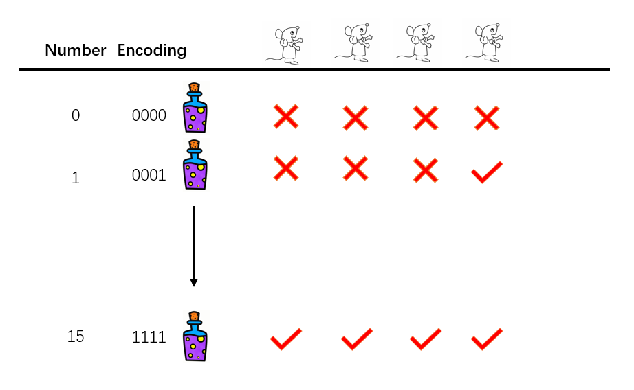

Here is an interesting but not straightforward question. Suppose there are 16 bottles of liquid. One of them is poisonous while others are normal water. You have some mice in hand and the task is to find poison in 24 hours using these mice. However, you can only tell whether a mouse drank poison after 24 hours. Now, how many mice do you have to use to find the poison?

It is not simple to most of people, if you don't have the insight. Let me state the result here: **If you have $$N$$ bottles, you need $$\log_2 N$$ mice at least. The result here is 4.**

But why?

<<<<<<< HEAD
The explanation involves encoding. First, we number bottles from 0 to 15. For all those bottles, we can using binary encoding to name them. For example, the bottle numbered 0 should be encoded as $$0000$$ and bottle numbered 14 should be encoded $$1110$$. We let mouse number one drank bottles whose first digit is encoded as 1 and mouse number two drank bottles whose second digit is encoded as 1 and so on. Suppose after 24 hours, dead mice set is $$S$$. Say $$S={1,3}$$. Then the poisonous bottle is encoded as $$1010$$ which is bottle number 10. The reason is that only this bottle is drunk by all those mice in $$S$$.

=======
The explanation involves encoding. First, we number bottles from 0 to 15. For all those bottles, we can using binary encoding to name them. For example, the bottle numbered 0 should be encoded as $$0000$$ and bottle numbered 14 should be encoded $$1110$$. We let mouse number one drank bottles whose first digit is encoded as 1 and mouse number two drank bottles whose second digit is encoded as 1 and so on. Suppose after 24 hours, dead mice set is $$S$$. Say $$S={1,3}$$. Then the poisonous bottle is encoded as $$1010$$ which is bottle number 10.

>>>>>>> parent of b632f09... Update 2019-09-23-How_to_find_poisson_from_numerous_bottles.md
