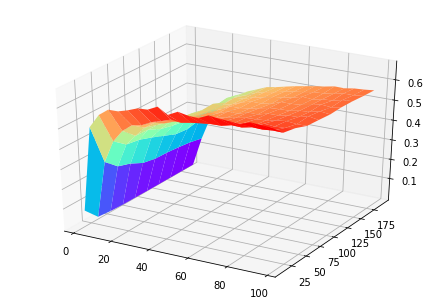

When I was reading paper(namely *The Relationship Between High-Dimensional Geometry and Adversarial Examples*) which generates a lot of points on the shell in high dimension, I thought of an interesting problem: **what is the maximum of their minimum mutual distance**. I googled and found [this](https://math.stackexchange.com/questions/1976250/what-is-the-maximum-distance-of-k-points-in-an-n-dimensional-hypercube) and [this](https://mathoverflow.net/questions/279382/maximum-average-euclidean-distance-between-n-points-in-1-1n), while the first link asked exactly what I meant but got no ideal solution and the second one only solved a special case. However, though it might be intuitively easy to think about how the MAXMIN case looks like, it is not straightforward to get a unified solution. That motivates this blog.

I chose $$N$$ from $$2$$ to $$100$$ with step $$5$$ and $$K$$ from $$10$$ to $$200$$ with step $$20$$ and ran simulation for all these cases in Google Colab(see [code](https://colab.research.google.com/drive/12oBtJPT_FGbEe2iByhTBkHR2Js5CWB2P)) and got this:

The illustration provides an insight which is also intuitively true. The MAXMIN increases as $$N$$ increases and decreases as $$K$$ increases. However, another insight is not trivial: difference of $$N$$ has more contribution in low dimension and higher $$N$$ alleviates the impact of $$K$$.

I know this work is rather immature, so leave comments and suggestions to me. Feel free to make more improvements to my simulation.

<h3 id="busuanzi_container_page_pv" style="align-content: center; color:brown; font: 200">
  Total readers: 
</h3>
